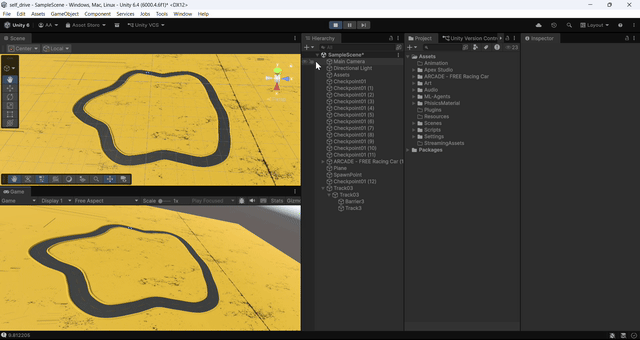
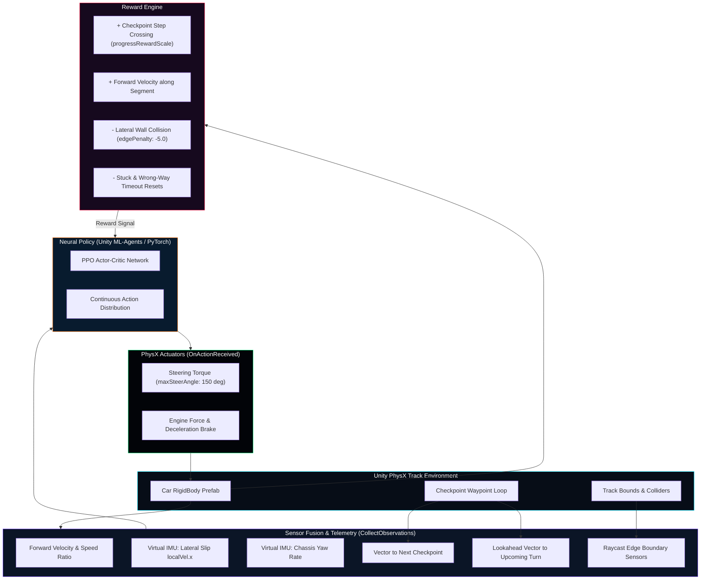

<div align="center">

# 🏎️ Autonomous Vehicle Simulation
### Deep Reinforcement Learning (PPO) with Unity ML-Agents & Virtual IMU Telemetry

[](https://unity.com/)
[](https://github.com/Unity-Technologies/ml-agents)
[-ff6f00?style=for-the-badge&logo=pytorch&logoColor=white)](https://openai.com/research/openai-baselines-ppo)
[](https://developer.nvidia.com/physx-sdk)
[](https://opensource.org/licenses/MIT)

<p align="center">
  
  
  
  
</p>

<p align="center">
  <b>An end-to-end self-driving car agent trained from scratch using deep reinforcement learning to navigate complex tracks, calculate lateral drift slip, avoid boundaries with LIDAR-style raycast sensors, and execute optimal racing lines.</b>
</p>

[Key Features](#-key-features) • [Simulation Preview](#-simulation-preview) • [RL Architecture](#-reinforcement-learning-architecture) • [Sensors & Observations](#-sensor-fusion--observation-space) • [Hyperparameters](#-ppo-hyperparameters--training) • [Quickstart](#-quickstart--installation) • [Code Structure](#-project-structure)

---

</div>

## 🎬 Simulation Preview

<div align="center">
  
</div>

<br/>

> 📹 **High-Definition Video**: [`AutonomousCar.mp4`](./AutonomousCar.mp4)  
> 📈 **Pretrained Policy Weights & TensorBoard Runs**: [`results/CarRun11/`](./results/CarRun11/)

---

## ⚡ Key Features

* 🧠 **Proximal Policy Optimization (PPO)**: Actor-Critic policy trained via Unity ML-Agents to autonomously command throttle, steering, and braking in continuous action space.
* 📡 **Virtual IMU & Drift Awareness**: Internal sensor calculations measure lateral tire slip (`localVel.x`) and chassis yaw rate (`angularVelocity.y`), teaching the neural network to sense and counteract skids.
* 🔍 **LIDAR-Style Raycast Edge Sensors**: Real-time raycasting (`CarEdgeSensors.cs`) probes track barriers and perimeter curbs to feed multi-angle proximity readings into the policy.
* 🎯 **Curve Lookahead & Waypoint Navigation**: Features dual-target spatial vector observations (`NextCheckpoint` + `LookaheadCheckpoint`) preventing the car from being blind to incoming sharp hairpin turns.
* 🏁 **Anti-Farming Checkpoint Curriculum**: Employs an $N-1$ checkpoint respawn mechanism and progress-delta thresholding to completely eliminate circular looping and reward exploitation.
* 🎮 **Dual Autonomous & Presentation Modes**: Seamlessly toggle between full neural inference, heuristic user drive mode, and an automated presentation PID mode.

---

## 🏗️ Reinforcement Learning Architecture

The autonomous agent operates in a continuous control loop inside Unity's PhysX engine:



---

## 📡 Sensor Fusion & Observation Space

The agent's vector sensor combines **physical state kinematics**, **inertial measurement unit (IMU) drift states**, and **path geometry**:

| Category | Observation Variable | Normalization | Physical Intuition |
|:---|:---|:---:|:---|
| **Forward Speed** | `rb.linearVelocity.magnitude / speedLimit` | $[0, 1]$ | Current normalized vehicle speed |
| **Heading Alignment** | `Vector3.Dot(transform.forward, velocity.normalized)` | $[-1, 1]$ | Alignment between chassis forward vector and velocity vector |
| **Virtual IMU Slip** | `localVelocity.x / speedLimit` | $[-1, 1]$ | **Drift indicator**: detects sideways skidding across track |
| **Chassis Yaw Rate** | `rb.angularVelocity.y / 5.0` | $[-1, 1]$ | How rapidly the vehicle is rotating around its vertical axis |
| **Next Waypoint** | `localDirToNext.x`, `localDirToNext.z` | $[-1, 1]$ | Relative 2D directional vector pointing to target checkpoint |
| **Lookahead Waypoint** | `localLookahead.x`, `localLookahead.z` | $[-1, 1]$ | Lookahead curve vector (target $N+1$) for anticipatory steering |
| **Perimeter Raycasts** | `CarEdgeSensors` distances | $[0, 1]$ | Real-time multi-angle distance to left/right asphalt boundaries |

---

## ⚖️ Reward Engineering & Safety Rules

$$R_{\text{total}} = R_{\text{checkpoint}} + R_{\text{velocity}} - P_{\text{collision}} - P_{\text{stagnation}}$$

```
┌─────────────────────────────────┬───────────┬─────────────────────────────────────────────────────────┐
│ Event / Metric                  │ Value     │ Condition & Mechanism                                   │
├─────────────────────────────────┼───────────┼─────────────────────────────────────────────────────────┤
│ Checkpoint Crossing             │ +0.20     │ Awarded immediately upon intersecting next road target  │
│ Forward Path Velocity           │ +0.01/dt  │ Proportional to forward velocity towards target         │
│ Boundary Collision              │ -5.00     │ Triggered if vehicle hits road boundaries; ends episode │
│ Off-Road Drift Limit            │ Reset     │ Distance > 20m from track segment triggers safety reset │
│ Stuck / Zero-Displacement       │ Reset     │ Displacement < threshold over accumulated window        │
│ Reverse / Wrong-Way Driving     │ Reset     │ Dot product < 0 for extended duration triggers reset   │
└─────────────────────────────────┴───────────┴─────────────────────────────────────────────────────────┘
```

> 💡 **Checkpoint-Based Respawn ($N-1$ Rule)**: Instead of resetting to the absolute starting line after every crash, the agent respawns at checkpoint $N-1$. This curriculum-style respawn allows the agent to practice difficult hairpin corners without having to drive through the entire lap repeatedly.

---

## ⚙️ PPO Hyperparameters & Training

The agent is trained using the **Proximal Policy Optimization (PPO)** algorithm defined in `trainer_config.yaml`:

```yaml
behaviors:
  CarDrivingBehavior:
    trainer_type: ppo
    hyperparameters:
      batch_size: 128        # Smaller batch size for frequent gradient updates
      buffer_size: 1024      # Compact buffer size: updates the policy twice as often
      learning_rate: 8.0e-4  # Accelerated learning rate for rapid track adaptation
      beta: 1.0e-2          # Entropy bonus encouraging initial corner exploration
      epsilon: 0.2          # PPO clip threshold preventing catastrophic policy drift
      lambd: 0.95           # Generalized Advantage Estimation (GAE) discount
      num_epoch: 7          # Optimization passes over collected buffer
    network_settings:
      normalize: true
      hidden_units: 128
      num_layers: 2
```

---

## 🚀 Quickstart & Installation

### Prerequisites
* **Unity Editor**: `2022.3 LTS` or `Unity 6`
* **Python**: `3.9` or `3.10`
* **PyTorch**: Compatible with your CUDA or CPU setup
* **Unity ML-Agents**: Package installed via Unity Package Manager

### 1. Clone the Repository
```bash
git clone https://github.com/ANIL6190/SlefDrivingCar_simulation.git
cd SlefDrivingCar_simulation
```

### 2. Set Up the Python Training Environment
```bash
# Create and activate virtual environment
python -m venv venv
# Windows:
.\venv\Scripts\activate
# Linux/macOS:
source venv/bin/activate

# Install Unity ML-Agents and PyTorch
pip install mlagents torch
```

### 3. Open in Unity
1. Open **Unity Hub** and click **Add Project from Disk**.
2. Select the cloned repository folder.
3. Open the main driving scene located under `Assets/Scenes/`.

### 4. Run Inference or Resume Training
* **Run Pretrained Agent (Play Mode)**:  
  Select the `Car` GameObject in the scene hierarchy, ensure its `Behavior Parameters` model is set to the trained ONNX neural model (`results/CarRun11/`), and press **Play** in the Unity Editor.

* **Start New Training Session**:
  ```bash
  mlagents-learn trainer_config.yaml --run-id=CarRun_New --resume
  ```
  Then press **Play** in Unity to begin training iterations.

* **Monitor with TensorBoard**:
  ```bash
  tensorboard --logdir results
  ```

---

## 📂 Project Structure

```
SlefDrivingCar_simulation/
├── Assets/
│   ├── Scripts/
│   │   ├── Car/
│   │   │   ├── CarAgent.cs               # Core ML-Agent: inputs, observations & rewards
│   │   │   ├── CarEdgeSensors.cs         # Raycast barrier & boundary detection
│   │   │   ├── CheckpointRecorder.cs     # Track checkpoints & anti-farming recorder
│   │   │   └── PresentationAutoPilot.cs  # Smooth PID demo & heuristic navigation
│   │   └── Camera/
│   │       └── CameraFollow.cs           # Smooth dynamic third-person chase camera
│   ├── Prefabs/                          # Vehicle model, checkpoint targets & track prefabs
│   └── Scenes/                           # Training tracks and evaluation circuits
├── results/
│   └── CarRun11/                         # Pretrained policy weights, checkpoints & logs
├── trainer_config.yaml                   # PPO hyperparameter configurations
├── AutonomousCar.gif                     # Animated simulation preview
├── AutonomousCar.mp4                     # High-definition video recording
└── README.md                             # Comprehensive documentation
```

---

## 🎮 Controls & Operating Modes

| Mode | Trigger | Description |
|:---|:---:|:---|
| **Autonomous RL (Default)** | In-game Play with Model set | Pure neural network inference driving using learned policy |
| **Presentation AutoPilot** | Enable `PresentationAutoPilot` | Smooth algorithmic waypoint following for presentations |
| **Manual Override** | Toggle `manualDrivingMode = true` | Control vehicle manually via Arrow Keys / WASD |

---

## 🛡️ License

This project is licensed under the **MIT License** — see the [LICENSE](LICENSE) file for details.

---

## 👨‍💻 Author & Acknowledgements

Developed by **[Anil A (ANIL6190)](https://github.com/ANIL6190)**.

- **Unity Technologies**: For the powerful **[ML-Agents Toolkit](https://github.com/Unity-Technologies/ml-agents)**.
- Built with **PhysX** rigid body dynamics and **PPO (Schulman et al., 2017)**.

<div align="center">
  <sub>⭐ If you enjoyed this autonomous simulation, don't forget to star the repository!</sub>
</div>
